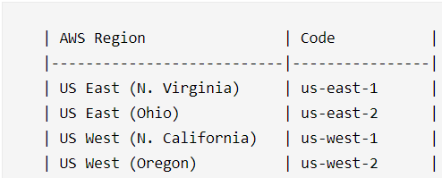

# AWS Infrastructure

## AWS Regions
- physical locations around the world having a cluster of data center
- need to select regions for all non-global aws services (ie lambda, ex2, elb, s3)
- global services  include: IAM, AWS Organisations, Rotute 53, Cloudfront, WAF
- Each AWS Region consists of multiple, isolated, and physically separate AZs within a geographic area.

## AZ
- is one or more discrete data centers with redundant power, networking, and connectivity
- AZs in AWS Region are interconnected with high-bandwidth, low-latency networking. (typically 3 - 6 AZs in a region)
- deploy applications across multiple AZs in same region for **high-availability, scalability, fault-tolerant and low-latency.**

