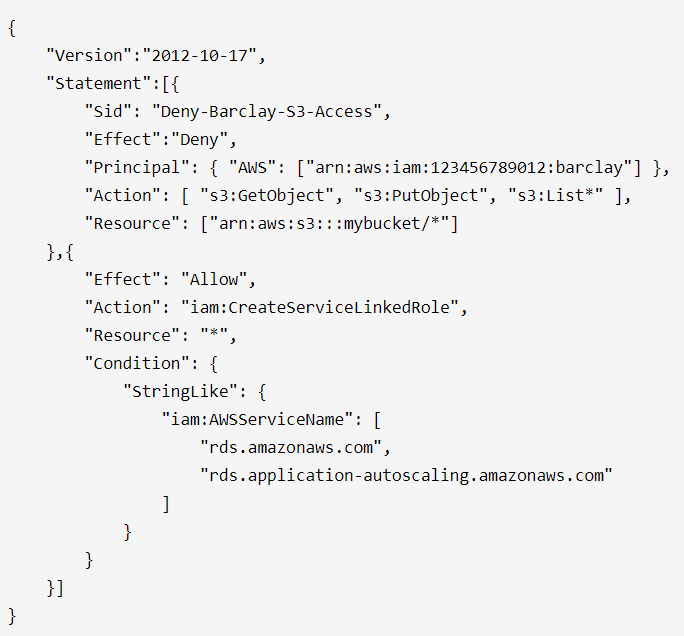

# IAM (Identity and Access Management)
- IAM is used to manage access to users and resources
- IAM is a global & free service
- Root account created by default with full administrator access, (b.p.) shouldn’t be used
- IAM Users mapped to physical user, should login to AWS console with their own **account and password**
- Groups can have one+ users, but cannot have other groups
- Policies are JSON documents that **Allow or Deny** the **access** on action can be performed on AWS resource by any user, group and role
    - Version: policy language version. (2012-10-17 is latest).
    - Statement: container for one or more policy statements
    - Sid: (optional) a way of labeling your policy statement
    - Effect: set whether the policy Allow or Deny
    - Principal: user, group, role, or federated user to which you would like to allow or deny access
    - Action one or more actions that can be performed on AWS resources
    - Resource one or more AWS resource to which actions apply
    - Condition (optional) one or more conditions to satisfy for policy to be applicable, otherwise ignore the policy
        

- Roles are associated with trusted entities - (AWS services, Another AWS account, Web Identity (Cognito or any OpenID provider), or SAML 2.0 federation (your corporate directory)). 
    - You attach policy to the role, these entities assume the role to access the AWS resources.

- Least Privilege Principle followed, don’t give more permission than a user needs.
- Resource Based Policies are supported by S3, SNS, and SQS ( a type of resource attached directly to aws resource defininf who can access it and wha actions can be perfomed on it)
- IAM Permission Boundaries to set at individual user or role for maximum allowed permissions
- IAM Policy Evaluation Logic: Explicit Deny ➔  Organization SCPs ➔  Resource-based Policies (optional) ➔  IAM Permission Boundaries ➔ Identity-based ((IAM) Policies
    - this is the process to determine if request to perform action on resouces is allowed/denid. (in order of priority)
- If you got SSL/TLS certificates from third-party CA, import the certificate into AWS Certificate Manager (ACM) or upload it to the IAM Certificate Store
  
## Access AWS programmatically
- AWS Management Console - Use password + MFA (multi factor authentication)
- AWS CLI or SDK - Use Access Key ID (~username) and Secret Access Key (~password)
- AWS CloudShell - CLI tool from AWS browser console - Require login to AWS

## Access AWS for Non-IAM users
- Non-IAM user first authenticate from Identity Federation -> Then provide a temporary token (IAM Role attached) generated by calling a AssumeRole API of STS (Security Token Service). Non-IAM user access the AWS resource by assuming IAM Role attached with token.

- can authenticate and authorize Non-IAM users using following Identity Federation:-
    - SAML 2.0 (old) to integrate Active Directory/ADFS, use AssumeRoleWithSAML STS API
    - Custom Identity Broker used when identity provider is not compatible to SAML 2.0, use AssumeRole or GetFederationToken STS API
    - Web Identity Federation is used to sign in using well-known external identity provider (IdP), such as login with Amazon, Facebook, Google, or any OpenID Connect (OIDC)- compatible IdP. Get the ID token from IdP, use AWS Cognito api to exchange ID token with cognito token, use AssumeRoleWithWebIdentity STS API to get temp security credential to access AWS resources
    - AWS Cognito is recommended identity provider by Amazon
    - Amazon Single Sign On gives single sign-on token to access AWS, no need to call STS API

###  AWS Directory Service
 can use to manage Active Directory (AD) in AWS for e.g.
- AWS Managed Microsoft AD is managed Microsoft Windows Server AD with trust connection to on-premise Microsoft AD. Best choice when you need all AD features to support AWS applications or Windows workloads. can be used for single sign-on for windows workloads.
- AD Connector is proxy service to redirect requests to on-premise Microsoft AD. Best choice to use existing on-premise AD with compatible AWS services.
- Simple AD is standalone AWS managed compatible AD powered by Samba 4 with basic directory features. You cannot connect it to on-premise AD. Best choice for basic directory features.
- Amazon Cognito is a user directory for sign-up and sign-in to mobile and web application using Cognito User Pools. Nothing to do with Microsoft AD.

#### make more note on ADS